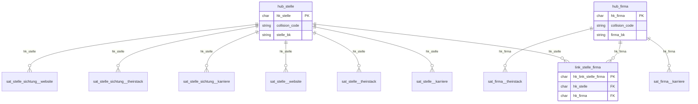

# Raw Vault: Lead-Engine

Quelle: `design/implementierungsplan.md`. Kollisionscode je Quelle (`karriere`, `theirstack`, `website`) in allen Hash Keys.

```mermaid
erDiagram
    hub_stelle ||--o{ link_stelle_firma : hk_stelle
    hub_firma ||--o{ link_stelle_firma : hk_firma
    hub_stelle ||--o{ sat_stelle__karriere : hk_stelle
    hub_stelle ||--o{ sat_stelle__theirstack : hk_stelle
    hub_stelle ||--o{ sat_stelle__website : hk_stelle
    hub_stelle ||--o{ sat_stelle_sichtung__karriere : hk_stelle
    hub_stelle ||--o{ sat_stelle_sichtung__theirstack : hk_stelle
    hub_stelle ||--o{ sat_stelle_sichtung__website : hk_stelle
    hub_firma ||--o{ sat_firma__karriere : hk_firma
    hub_firma ||--o{ sat_firma__theirstack : hk_firma
    hub_stelle { char hk_stelle PK
        string collision_code
        string stelle_bk }
    hub_firma { char hk_firma PK
        string collision_code
        string firma_bk }
    link_stelle_firma { char hk_link_stelle_firma PK
        char hk_stelle FK
        char hk_firma FK }
```
